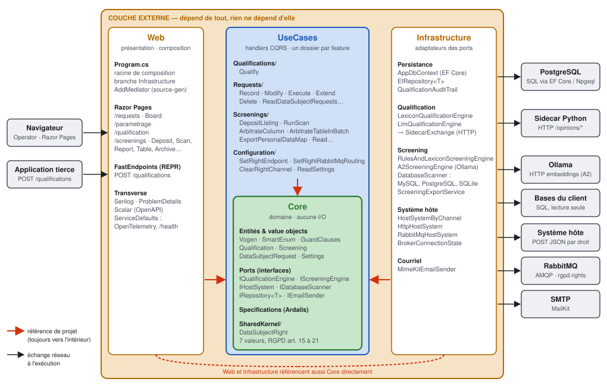

# microservice_rgpd

Un microservice embarquable qui orchestre les demandes d'exercice des droits RGPD d'une application
existante, avec une IA d'assistance pour deux tâches : **cartographier** les données personnelles
d'une base inconnue et **qualifier** une demande rédigée en texte libre.

Ce dépôt est la preuve de concept du mémoire de Master 2 d'Amaury TISSOT (IPSSI, 2026). La version
citée dans le mémoire est la release [`v1.0-memoire`](https://github.com/AmauryTISSOT/microservice_rgpd/releases/tag/v1.0-memoire).

## Le problème

« Supprimez mon compte. » Le RGPD impose d'y répondre dans un délai d'un mois. Pourtant, dans la
plupart des applications en service, personne ne sait dire où se trouvent les données de la personne
qui le demande. Les plateformes de conformité du marché sont lourdes, propriétaires et pensées pour
équiper une organisation entière.

Le mémoire défend une autre voie : une brique légère, branchée à l'application existante, qui reste
générique et respecte elle-même les exigences qu'elle aide à tenir. **La machine propose, l'humain
décide** : chaque verdict de l'IA est relu par un opérateur avant d'avoir un effet.

## Ce que fait le microservice

| Contexte | Rôle | Documentation |
| --- | --- | --- |
| **Screening** | Cartographie : détecte les colonnes qui portent vraisemblablement des données personnelles ; le moteur ne lit que les noms, jamais les valeurs. Un opérateur retient ou écarte chaque colonne. | [CONTEXT](docs/contexts/screening/CONTEXT.md) |
| **Qualification** | Dit quels droits un texte libre exerce (accès, effacement, portabilité…), avec un LLM auto-hébergé et un lexique qui le contrôle. | [CONTEXT](docs/contexts/qualification/CONTEXT.md) · [API](docs/api/qualifications.md) |
| **Requests** | Enregistre une demande, suit son délai légal, la prolonge si besoin, puis l'exécute auprès de l'application hôte. | [CONTEXT](docs/contexts/requests/CONTEXT.md) |
| **Configuration** | Le paramétrage : pour chaque droit, le canal par lequel l'application hôte le reçoit (adresse HTTP ou routage RabbitMQ). | [CONTEXT](docs/contexts/configuration/CONTEXT.md) |

La [carte des contextes](CONTEXT-MAP.md) décrit leurs frontières et leur vocabulaire.

## Architecture



Le service suit une Clean Architecture : les dépendances pointent toujours vers le domaine. Il est
écrit en .NET 10, sur PostgreSQL, et orchestré localement par .NET Aspire. La qualification tourne
dans un sidecar Python, et les modèles sont servis par Ollama, sur la machine : aucune donnée ne sort
vers un service d'IA tiers.

```
src/
  MicroserviceRgpd.Core/            # Domaine : entités, value objects, ports — aucune I/O
  MicroserviceRgpd.UseCases/        # Handlers CQRS, un dossier par fonctionnalité
  MicroserviceRgpd.Infrastructure/  # EF Core, moteurs de détection, scanner de bases, système hôte
  MicroserviceRgpd.Web/             # Écrans Razor Pages et API FastEndpoints
  MicroserviceRgpd.AspireHost/      # Orchestration locale de toute la pile
  MicroserviceRgpd.ServiceDefaults/ # OpenTelemetry, health checks, résilience
  sidecar/                          # Moteurs de qualification (Python, FastAPI)
  mock-host/                        # Faux système hôte, pour les essais locaux
tests/                              # Unitaires, intégration, fonctionnels, navigateur (Playwright)
```

Les 29 décisions d'architecture sont consignées dans [`docs/adr/`](docs/adr/).

## Du mémoire au code

| Mémoire | Dans le dépôt |
| --- | --- |
| Partie 2, I — Du besoin à la spécification | [`docs/spec/`](docs/spec/qualification.md), [`CONTEXT-MAP.md`](CONTEXT-MAP.md), [`docs/contexts/`](docs/contexts/) |
| Partie 2, II — Choix technologiques, Clean Architecture | [`src/`](src/), [`docs/adr/`](docs/adr/), [schéma](docs/architecture/clean-architecture.svg) |
| Partie 2, II, C — Intégration à l'application hôte | [ADR-0026](docs/adr/0026-executer-une-demande-requests-lit-le-parametrage-et-appelle-le-systeme-hote.md), [ADR-0027](docs/adr/0027-un-droit-un-seul-canal-une-adresse-http-ou-un-routage-rabbitmq.md), [ADR-0028](docs/adr/0028-l-aboutissement-d-une-execution-cesse-d-etre-un-2xx-le-broker-accuse-reception.md), [`src/mock-host/`](src/mock-host/README.md) |
| Partie 2, III — La cartographie des données personnelles | [`src/MicroserviceRgpd.Infrastructure/Screenings/`](src/MicroserviceRgpd.Infrastructure/Screenings/), [requêtes d'introspection](releves/), [modèle A2 embarqué](src/MicroserviceRgpd.Infrastructure/Screenings/Embeddings/Artefact/README.md), [ADR-0025](docs/adr/0025-la-detection-passe-a-un-modele-a-plongements-servi-par-ollama-le-lexique-en-repli-de-deploiement.md) |
| Partie 2, III — Corpus de schémas annotés et banc d'essai | [`corpus/schemas/`](corpus/schemas/README.md), [`exploration/banc-screening/`](exploration/banc-screening/README.md), [sources et licences](corpus/SOURCES.md) |
| Partie 2, IV — La qualification assistée par l'IA | [`src/sidecar/`](src/sidecar/README.md), [corpus de 120 demandes](corpus/README.md), [`docs/api/qualifications.md`](docs/api/qualifications.md) |
| Partie 3, I et II — L'application témoin Brocanto | [`brocanto/`](brocanto/README.md) |
| Partie 3, III, B — Évaluation des modèles IA | [`exploration/`](exploration/README.md), [`corpus/`](corpus/) |
| Partie 3, IV — Second contexte : Dolibarr | [`dolibarr/`](dolibarr/README.md) |

Le corpus d'entraînement de 47 schémas et la comparaison des approches A0 à A4 ont été menés dans
des dépôts de recherche distincts ; voir [`corpus/SOURCES.md`](corpus/SOURCES.md).

## Lancer le projet

Prérequis : le SDK .NET 10, Docker, et [`uv`](https://docs.astral.sh/uv/) pour le sidecar Python.

```sh
dotnet run --project src/MicroserviceRgpd.AspireHost
```

Cette commande démarre toute la pile : le service, sa base PostgreSQL et le sidecar de
qualification. Le dashboard Aspire donne l'adresse des écrans. Par défaut, **aucun modèle n'est
téléchargé et aucun GPU n'est requis** : la qualification tourne alors en mode dégradé, avec le seul
lexique. Pour activer le LLM (`qwen3:8b`, GPU NVIDIA requis) ou le modèle de détection A2, voir
[`DEVELOPPEMENT.md`](DEVELOPPEMENT.md).

L'application témoin se lance à part :

```sh
cd brocanto && docker compose up --build   # http://localhost:8080
```

Les tests, les drapeaux de configuration et le détail de la pile sont dans
[`DEVELOPPEMENT.md`](DEVELOPPEMENT.md).

## Méthode de développement

Comme l'indique le mémoire, le code n'a pas été écrit à la main : il a été produit en programmation
agentique, avec [Claude Code](https://claude.com/claude-code). L'agentique n'est pas l'objet de
l'étude, c'est le moyen qui a permis de couvrir ce périmètre dans le temps imparti : deux langages,
deux moteurs d'IA et deux applications hôtes.

Le travail a suivi un cadre écrit, dont le dépôt garde la trace :

- **Tickets et pull requests.** Les évolutions partent d'une issue GitHub et arrivent par une pull
  request : près de 300 tickets et 240 pull requests.
- **Décisions consignées.** Chaque choix structurant fait l'objet d'un ADR ([`docs/adr/`](docs/adr/)),
  qui donne le contexte, la décision et ses conséquences.
- **Vocabulaire fixé.** Chaque contexte a son glossaire (`docs/contexts/*/CONTEXT.md`), qui fixe les termes
  employés dans le code et à l'écran.
- **Tests à chaque étape.** Tests unitaires, d'intégration sur un vrai PostgreSQL, fonctionnels, de
  navigateur, et `pytest` pour les parties Python.
- **Instructions de l'agent.** [`CLAUDE.md`](CLAUDE.md) et [`docs/agents/`](docs/agents/) décrivent
  à l'agent les conventions du dépôt.

## Licences

- Code : [MIT](LICENSE). Le projet est issu du template
  [ardalis/CleanArchitecture](https://github.com/ardalis/CleanArchitecture), sous licence MIT
  également.
- Corpus (`corpus/`) : [CC BY-SA 4.0](corpus/LICENSE). Les schémas relevés proviennent d'applications
  libres, listées avec leur version et leur licence dans [`corpus/SOURCES.md`](corpus/SOURCES.md).
- Toutes les données personnelles présentes dans le dépôt (Brocanto, corpus de demandes, jeux
  d'essai) sont fictives.
